# TRCAA Architecture Documentation

**Troubleshooting and RCA Assistant** — C4-model architecture documentation using Mermaid diagrams.

---

## Table of Contents

1. [System Context (C4 Level 1)](#system-context)
2. [Container Architecture (C4 Level 2)](#container-architecture)
3. [Component Architecture (C4 Level 3)](#component-architecture)
4. [Data Architecture](#data-architecture)
5. [Security Architecture](#security-architecture)
6. [AI Provider Architecture](#ai-provider-architecture)
7. [Integration Architecture](#integration-architecture)
8. [Deployment Architecture](#deployment-architecture)
9. [Key Data Flows](#key-data-flows)
10. [Architecture Decision Records](#architecture-decision-records)

---

## System Context

The system context diagram shows TRCAA in relation to its users and external systems.

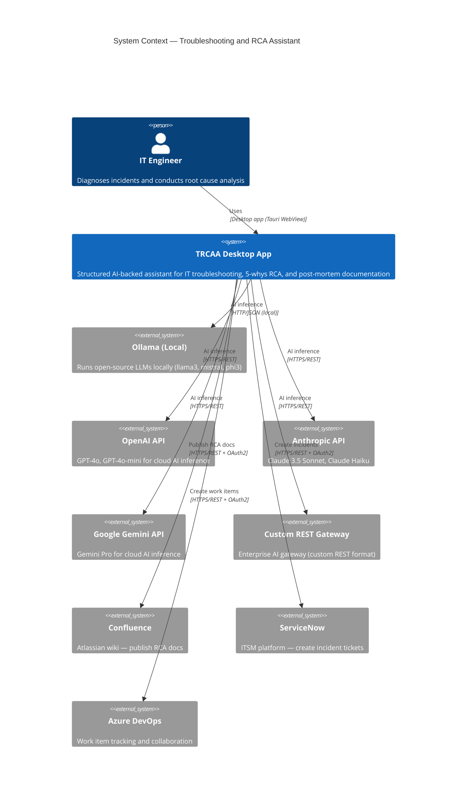

---

## Container Architecture

TRCAA is a single-process Tauri 2 desktop application. The "containers" are logical boundaries within the process.

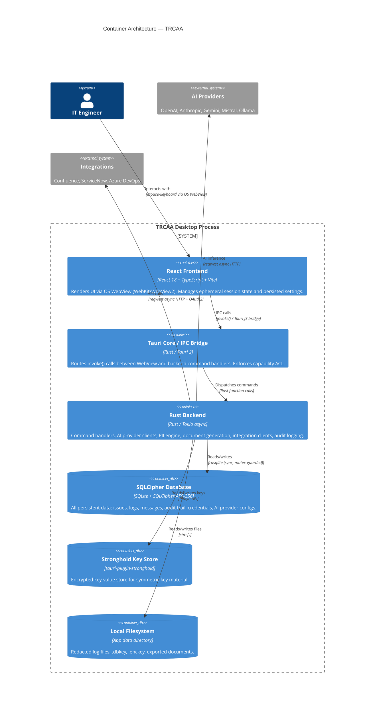

---

## Component Architecture

### Shell Execution System (v1.0.0+)

**Status**: Production-ready agentic shell command execution with three-tier safety classification.

**Architecture**: Three-tier safety system with automatic classification, approval gates, and audit logging.

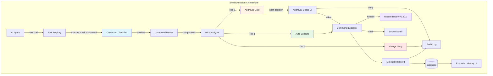

**Three-Tier Safety Classification**:

- **Tier 1 (Auto-execute)**: Read-only operations with no side effects
  - Examples: `kubectl get`, `kubectl describe`, `kubectl logs`, `cat`, `grep`, `ls`, `pvecm status`
  - Executes immediately without user interaction

- **Tier 2 (User approval required)**: Potentially mutating operations
  - Examples: `kubectl apply`, `kubectl delete`, `kubectl scale`, `chmod`, `systemctl restart`, `ssh`
  - Shows real-time approval modal with command details
  - Supports "Allow Once", "Allow for Session", and "Deny"

- **Tier 3 (Always deny)**: Destructive operations
  - Examples: `rm -rf`, `shutdown`, `mkfs`, `dd`, `:(){:|:&};:`
  - Automatically rejected with explanation to user

**Key Modules**:

| Module | Responsibility | Key Features |
|--------|---------------|--------------|
| `shell/classifier.rs` | Command safety classification | 19 unit tests, pipe/chain analysis, command substitution detection |
| `shell/executor.rs` | Execution flow with approval gates | Timeout handling, kubeconfig injection, exit code capture |
| `shell/kubectl.rs` | kubectl binary management | Cross-platform binary bundling, version v1.30.0 |
| `shell/kubeconfig.rs` | Kubeconfig parsing and encryption | AES-256-GCM encryption, context extraction, cluster URL parsing |
| `commands/shell.rs` | 7 Tauri IPC commands | kubeconfig CRUD, execution, history retrieval |
| `ai/tools.rs` | Tool registration | `execute_shell_command` tool definition with parameters |

**Database Schema** (Migrations 024-027):

```sql
-- Pre-defined command templates with tier definitions
CREATE TABLE shell_commands (
    id TEXT PRIMARY KEY,
    command_template TEXT NOT NULL,
    tier INTEGER NOT NULL CHECK(tier IN (1, 2, 3)),
    description TEXT,
    category TEXT NOT NULL,
    created_at TEXT NOT NULL
);

-- Encrypted kubeconfig storage
CREATE TABLE kubeconfig_files (
    id TEXT PRIMARY KEY,
    name TEXT NOT NULL,
    encrypted_content TEXT NOT NULL,
    context TEXT NOT NULL,
    cluster_url TEXT,
    is_active INTEGER NOT NULL DEFAULT 0,
    uploaded_at TEXT NOT NULL
);

-- Full audit trail for all executions
CREATE TABLE command_executions (
    id TEXT PRIMARY KEY,
    issue_id TEXT,
    command TEXT NOT NULL,
    tier INTEGER NOT NULL,
    approval_status TEXT NOT NULL,
    kubeconfig_id TEXT,
    exit_code INTEGER,
    stdout TEXT,
    stderr TEXT,
    execution_time_ms INTEGER,
    executed_at TEXT NOT NULL
);

-- Session-based approval preferences
CREATE TABLE approval_decisions (
    id TEXT PRIMARY KEY,
    command_pattern TEXT NOT NULL,
    decision TEXT NOT NULL CHECK(decision IN ('allow_once', 'allow_session', 'deny')),
    session_id TEXT,
    decided_at TEXT NOT NULL,
    expires_at TEXT
);
```

**Security Features**:
- AES-256-GCM encryption for kubeconfig files
- Command tier escalation for pipes and command substitution
- Full audit logging of all commands (approved, denied, executed)
- Session-based approval memory with expiration
- kubectl binary bundled and verified (no system dependency)

**Frontend Components**:
- `ShellApprovalModal.tsx`: Real-time approval UI with command preview
- `Settings/ShellExecution.tsx`: Settings and execution history viewer
- `Settings/KubeconfigManager.tsx`: Multi-cluster kubeconfig management

**Documentation**: `docs/wiki/Shell-Execution.md`

---

### MCP Server Integration (v1.0.0+)

**Status**: Production-ready Model Context Protocol integration for external tool protocols.

**Architecture**: Client-server protocol adapter for stdio and HTTP transports.

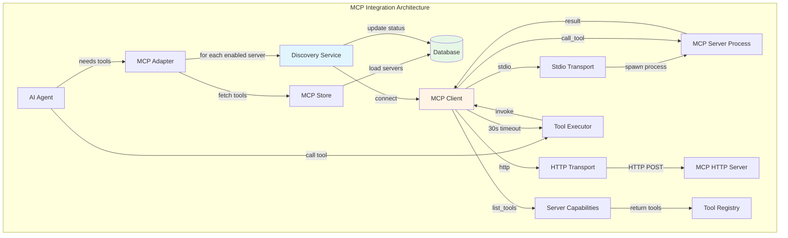

**Key Modules**:

| Module | Responsibility | Key Features |
|--------|---------------|--------------|
| `mcp/client.rs` | Connect to MCP servers | Stdio/HTTP transports, 30s tool call timeout |
| `mcp/adapter.rs` | Tool registry integration | Fetch tools from all enabled servers, merge with static tools |
| `mcp/discovery.rs` | Server health checks | Connection status updates, error tracking |
| `mcp/store.rs` | Database CRUD | Server config, tool/resource persistence |
| `mcp/models.rs` | Data models | McpServer, McpTool, McpResource types |
| `mcp/transport/stdio.rs` | Stdio transport | Process spawning, environment variables |
| `mcp/transport/http.rs` | HTTP transport | Custom headers, auth support |
| `mcp/commands.rs` | 7 Tauri IPC commands | Server CRUD, discovery, tool/resource listing |

**Database Schema** (Migration 018):

```sql
CREATE TABLE mcp_servers (
    id TEXT PRIMARY KEY,
    name TEXT NOT NULL,
    url TEXT NOT NULL,
    transport_type TEXT NOT NULL CHECK(transport_type IN ('stdio', 'http')),
    transport_config TEXT NOT NULL DEFAULT '{}',
    auth_type TEXT NOT NULL CHECK(auth_type IN ('none', 'api_key', 'bearer', 'oauth2')),
    auth_value TEXT,
    enabled INTEGER NOT NULL DEFAULT 1,
    last_discovered_at TEXT,
    discovery_status TEXT NOT NULL DEFAULT 'pending'
        CHECK(discovery_status IN ('pending','connected','unreachable','error')),
    discovery_error TEXT,
    env_config TEXT,
    created_at TEXT NOT NULL,
    updated_at TEXT NOT NULL
);

CREATE TABLE mcp_tools (
    id TEXT PRIMARY KEY,
    server_id TEXT NOT NULL,
    name TEXT NOT NULL,
    tool_key TEXT NOT NULL,
    description TEXT,
    parameters TEXT NOT NULL DEFAULT '{}',
    FOREIGN KEY(server_id) REFERENCES mcp_servers(id) ON DELETE CASCADE
);

CREATE TABLE mcp_resources (
    id TEXT PRIMARY KEY,
    server_id TEXT NOT NULL,
    uri TEXT NOT NULL,
    name TEXT,
    description TEXT,
    FOREIGN KEY(server_id) REFERENCES mcp_servers(id) ON DELETE CASCADE
);
```

**Tool Calling Flow**:
1. AI agent requests available tools
2. Adapter fetches static tools (`ai/tools.rs::get_available_tools()`)
3. Adapter fetches MCP tools from all enabled servers
4. Tools merged and returned to AI agent
5. AI agent calls tool by name (e.g., `server_name.tool_name`)
6. Adapter routes to correct MCP client
7. Client invokes tool with 30-second timeout
8. Result returned to AI agent

**Security**:
- Auth credentials stored with AES-256-GCM encryption
- Environment variables isolated per server process
- 30-second hard timeout prevents indefinite hangs
- Server connection status tracked and displayed

**Frontend Components**:
- `Settings/MCPServers.tsx`: Server configuration and discovery UI
- `Settings/MCPTools.tsx`: Tool browser and tester

---

### AI Tool Calling & Auto-Detection (v1.0.8+)

**Status**: Production-ready automatic tool calling support detection.

**Architecture**: Test-based detection with graceful degradation.

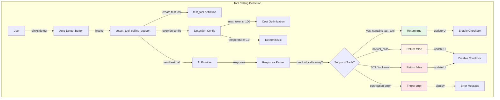

**Test Tool Definition**:

```rust
Tool {
    name: "test_tool".to_string(),
    description: "A test tool that returns 'success'. Call this tool with no arguments.".to_string(),
    parameters: ToolParameters {
        param_type: "object".to_string(),
        properties: HashMap::new(),
        required: vec![],
    },
}
```

**Detection Criteria**:

| Scenario | Result | Action |
|----------|--------|--------|
| Provider returns `tool_calls` array with `test_tool` | ✅ Supported | Enable checkbox, show success message |
| Provider responds without `tool_calls` | ⚠️ Not supported | Disable checkbox, show warning |
| Gateway returns 503 / "tool" error (e.g., MSI GenAI) | ⚠️ Blocked | Disable checkbox, show warning |
| Connection/auth/timeout error | ❌ Error | Show error message, don't change checkbox |

**Optimizations**:
- `max_tokens: 100` (reduces cost for detection test)
- `temperature: 0.0` (deterministic responses)
- Error pattern matching for gateway-level blocks

**Key Files**:
- `commands/ai.rs::detect_tool_calling_support()`: Backend detection logic (5 unit tests)
- `pages/Settings/AIProviders.tsx::handleAutoDetectToolCalling()`: Frontend UI (7 unit tests)
- `lib/tauriCommands.ts::detectToolCallingSupportCmd()`: TypeScript wrapper

**Database**: Uses `ai_providers.supports_tool_calling` column (Migration 028)

**Documentation**: `docs/wiki/AI-Providers.md` section "Tool Calling Auto-Detection"

---

### Backend Components

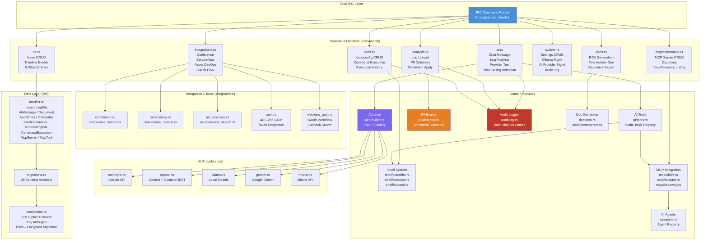

### Frontend Components

```mermaid
graph TD
    subgraph "React Application (src/)"
        APP[App.tsx\nSidebar + Router\nTheme Provider]
    end

    subgraph "Pages (src/pages/)"
        DASHBOARD[Dashboard\nStats + Quick Actions]
        NEW_ISSUE[NewIssue\nCreate Form]
        LOG_UPLOAD[LogUpload\nFile Upload + PII Review]
        TRIAGE[Triage\n5-Whys AI Chat]
        RESOLUTION[Resolution\nStep Tracking]
        RCA[RCA\nDocument Editor]
        POSTMORTEM[Postmortem\nDocument Editor]
        HISTORY[History\nSearch + Filter]
        SETTINGS[Settings\nProviders / Ollama\nIntegrations / Security]
    end

    subgraph "Components (src/components/)"
        CHAT_WIN[ChatWindow\nStreaming Messages]
        DOC_EDITOR[DocEditor\nMarkdown Editor]
        PII_DIFF[PiiDiffViewer\nSide-by-side Diff]
        HW_REPORT[HardwareReport\nSystem Specs]
        MODEL_SEL[ModelSelector\nProvider Dropdown]
        TRIAGE_PROG[TriageProgress\n5-Whys Steps]
    end

    subgraph "State (src/stores/)"
        SESSION[sessionStore\nEphemeral — NOT persisted\nCurrentIssue / Messages\nPiiSpans / WhyLevel]
        SETTINGS_STORE[settingsStore\nPersisted to localStorage\nTheme / ActiveProvider\nPiiPatterns]
        HISTORY_STORE[historyStore\nCached issue list\nSearch results]
    end

    subgraph "IPC Layer (src/lib/)"
        IPC[tauriCommands.ts\nTyped invoke() wrappers\nAll Tauri commands]
        PROMPTS[domainPrompts.ts\n8 Domain System Prompts]
    end

    APP --> DASHBOARD
    APP --> TRIAGE
    APP --> LOG_UPLOAD
    APP --> HISTORY
    APP --> SETTINGS

    TRIAGE --> CHAT_WIN
    TRIAGE --> TRIAGE_PROG
    LOG_UPLOAD --> PII_DIFF
    RCA --> DOC_EDITOR
    POSTMORTEM --> DOC_EDITOR
    SETTINGS --> HW_REPORT
    SETTINGS --> MODEL_SEL

    TRIAGE --> SESSION
    TRIAGE --> SETTINGS_STORE
    HISTORY --> HISTORY_STORE
    SETTINGS --> SETTINGS_STORE

    CHAT_WIN --> IPC
    LOG_UPLOAD --> IPC
    RCA --> IPC
    SETTINGS --> IPC

    IPC --> PROMPTS

    style SESSION fill:#e74c3c,color:#fff
    style SETTINGS_STORE fill:#27ae60,color:#fff
    style IPC fill:#4a90d9,color:#fff
```

---

## Data Architecture

### Database Schema

```mermaid
erDiagram
    issues {
        TEXT id PK
        TEXT title
        TEXT description
        TEXT severity
        TEXT status
        TEXT category
        TEXT source
        TEXT assigned_to
        TEXT tags
        TEXT created_at
        TEXT updated_at
    }
    log_files {
        TEXT id PK
        TEXT issue_id FK
        TEXT file_name
        TEXT content_hash
        TEXT mime_type
        INTEGER size_bytes
        INTEGER redacted
        TEXT created_at
    }
    pii_spans {
        TEXT id PK
        TEXT log_file_id FK
        INTEGER start_offset
        INTEGER end_offset
        TEXT original_value
        TEXT replacement
        TEXT pattern_type
        INTEGER approved
    }
    ai_conversations {
        TEXT id PK
        TEXT issue_id FK
        TEXT provider_name
        TEXT model_name
        TEXT created_at
    }
    ai_messages {
        TEXT id PK
        TEXT conversation_id FK
        TEXT role
        TEXT content
        INTEGER token_count
        TEXT created_at
    }
    resolution_steps {
        TEXT id PK
        TEXT issue_id FK
        INTEGER step_order
        TEXT question
        TEXT answer
        TEXT evidence
        TEXT created_at
    }
    documents {
        TEXT id PK
        TEXT issue_id FK
        TEXT doc_type
        TEXT title
        TEXT content_md
        TEXT created_at
        TEXT updated_at
    }
    audit_log {
        TEXT id PK
        TEXT action
        TEXT entity_type
        TEXT entity_id
        TEXT prev_hash
        TEXT entry_hash
        TEXT details
        TEXT created_at
    }
    credentials {
        TEXT id PK
        TEXT service UNIQUE
        TEXT token_type
        TEXT encrypted_token
        TEXT token_hash
        TEXT expires_at
        TEXT created_at
    }
    integration_config {
        TEXT id PK
        TEXT service UNIQUE
        TEXT base_url
        TEXT username
        TEXT project_name
        TEXT space_key
        INTEGER auto_create
    }
    ai_providers {
        TEXT id PK
        TEXT name UNIQUE
        TEXT provider_type
        TEXT api_url
        TEXT encrypted_api_key
        TEXT model
        TEXT config_json
        INTEGER supports_tool_calling
    }
    issues_fts {
        TEXT rowid FK
        TEXT title
        TEXT description
    }
    shell_commands {
        TEXT id PK
        TEXT command_template
        INTEGER tier
        TEXT description
        TEXT category
    }
    kubeconfig_files {
        TEXT id PK
        TEXT name
        TEXT encrypted_content
        TEXT context
        TEXT cluster_url
        INTEGER is_active
    }
    command_executions {
        TEXT id PK
        TEXT issue_id FK
        TEXT command
        INTEGER tier
        TEXT approval_status
        TEXT kubeconfig_id FK
        INTEGER exit_code
        TEXT stdout
        TEXT stderr
        INTEGER execution_time_ms
        TEXT executed_at
    }
    approval_decisions {
        TEXT id PK
        TEXT command_pattern
        TEXT decision
        TEXT session_id
        TEXT decided_at
        TEXT expires_at
    }
    mcp_servers {
        TEXT id PK
        TEXT name
        TEXT url
        TEXT transport_type
        TEXT auth_type
        TEXT auth_value
        INTEGER enabled
        TEXT discovery_status
        TEXT env_config
    }
    mcp_tools {
        TEXT id PK
        TEXT server_id FK
        TEXT name
        TEXT tool_key
        TEXT description
        TEXT parameters
    }
    mcp_resources {
        TEXT id PK
        TEXT server_id FK
        TEXT uri
        TEXT name
        TEXT description
    }

    issues ||--o{ log_files : "has"
    issues ||--o{ ai_conversations : "has"
    issues ||--o{ resolution_steps : "has"
    issues ||--o{ documents : "has"
    issues ||--o{ command_executions : "has"
    issues ||--|| issues_fts : "indexed by"
    log_files ||--o{ pii_spans : "contains"
    ai_conversations ||--o{ ai_messages : "contains"
    command_executions }o--|| kubeconfig_files : "uses"
    mcp_servers ||--o{ mcp_tools : "exposes"
    mcp_servers ||--o{ mcp_resources : "exposes"
```

### Data Flow — Issue Triage Lifecycle

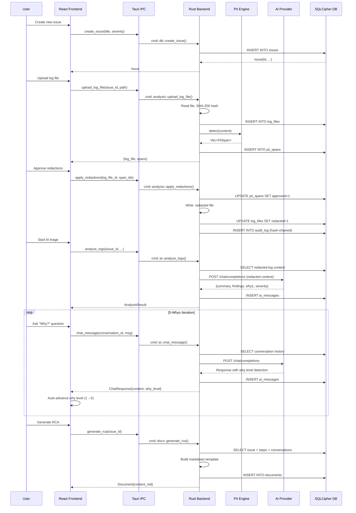

---

## Security Architecture

### Security Layers

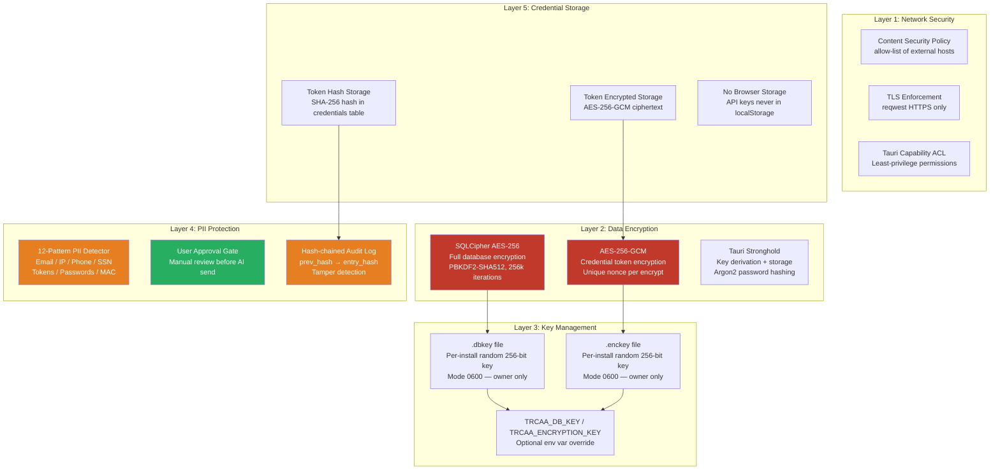

### Shell Execution Security (v1.0.0+)

**Three-tier safety classification protects against accidental or malicious command execution.**

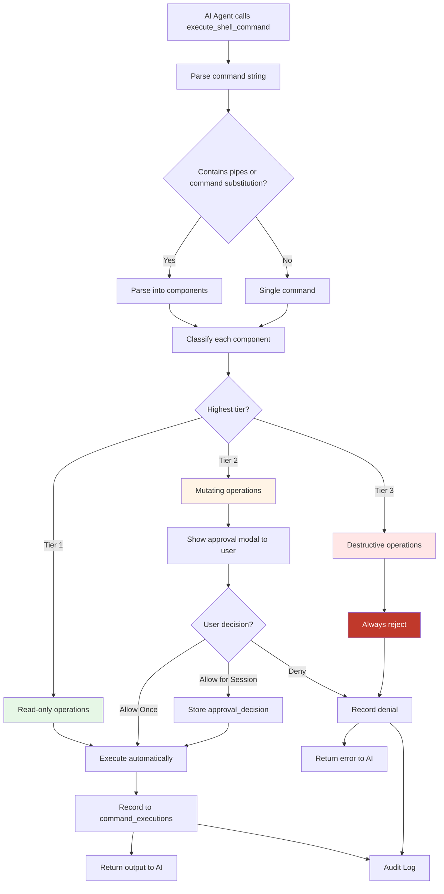

**Tier Classification Rules**:

| Tier | Safety Level | Examples | Action |
|------|--------------|----------|--------|
| Tier 1 | Read-only | `kubectl get`, `cat`, `grep`, `ls`, `pvecm status` | Auto-execute |
| Tier 2 | Mutating | `kubectl apply`, `chmod`, `systemctl restart`, `ssh` | User approval |
| Tier 3 | Destructive | `rm -rf`, `shutdown`, `mkfs`, `dd`, fork bombs | Always deny |

**Escalation Rules**:
- Command with pipe (`|`) or chain (`&&`, `||`, `;`) → highest tier wins
- Command substitution (`` `...` `` or `$(...)`) → escalate Tier 1 to Tier 2
- Single Tier 3 command in chain → entire command becomes Tier 3

**Kubeconfig Encryption**:
- All kubeconfig files encrypted with AES-256-GCM before storage
- Decrypted on-demand for kubectl execution
- Encryption key from `TRCAA_ENCRYPTION_KEY` env var or `.enckey` file

**Audit Trail**:
- All commands logged to `command_executions` table
- Includes: command text, tier, approval status, exit code, stdout, stderr, execution time
- Linked to issue_id for incident context
- Session-based approval decisions stored separately with expiration

---

### Authentication Flow — OAuth2 Integration

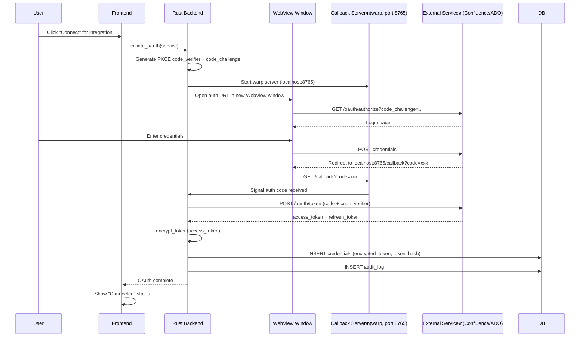

---

## AI Provider Architecture

### Provider Trait Pattern

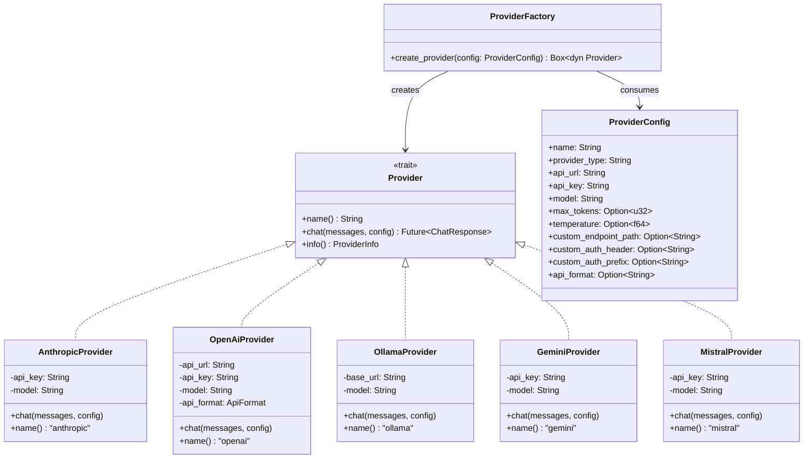

### Tool Calling Flow (Azure DevOps)

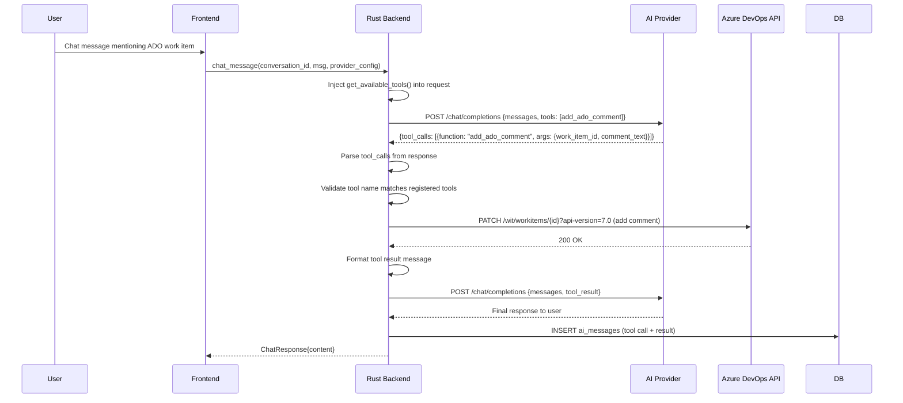

---

## Integration Architecture

```mermaid
graph LR
    subgraph "Integration Layer (integrations/)"
        AUTH[auth.rs\nToken Encryption\nOAuth + PKCE\nCookie Extraction]

        subgraph "Confluence"
            CF[confluence.rs\nPublish Documents\nSpace Management]
            CF_SEARCH[confluence_search.rs\nContent Search\nPersistent WebView]
        end

        subgraph "ServiceNow"
            SN[servicenow.rs\nCreate Incidents\nUpdate Records]
            SN_SEARCH[servicenow_search.rs\nIncident Search\nKnowledge Base]
        end

        subgraph "Azure DevOps"
            ADO[azuredevops.rs\nWork Items CRUD\nComments (AI tool)]
            ADO_SEARCH[azuredevops_search.rs\nWork Item Search\nPersistent WebView]
        end

        subgraph "Auth Infrastructure"
            WV_AUTH[webview_auth.rs\nOAuth WebView\nLogin Flow]
            CB_SERVER[callback_server.rs\nwarp HTTP Server\nlocalhost:8765]
            NAT_COOKIES[native_cookies*.rs\nPlatform Cookie\nExtraction]
        end
    end

    subgraph "External Services"
        CF_EXT[Atlassian Confluence\nhttps://*.atlassian.net]
        SN_EXT[ServiceNow\nhttps://*.service-now.com]
        ADO_EXT[Azure DevOps\nhttps://dev.azure.com]
    end

    AUTH --> CF
    AUTH --> SN
    AUTH --> ADO
    WV_AUTH --> CB_SERVER
    WV_AUTH --> NAT_COOKIES

    CF --> CF_EXT
    CF_SEARCH --> CF_EXT
    SN --> SN_EXT
    SN_SEARCH --> SN_EXT
    ADO --> ADO_EXT
    ADO_SEARCH --> ADO_EXT

    style AUTH fill:#c0392b,color:#fff
```

---

## Deployment Architecture

### CI/CD Pipeline

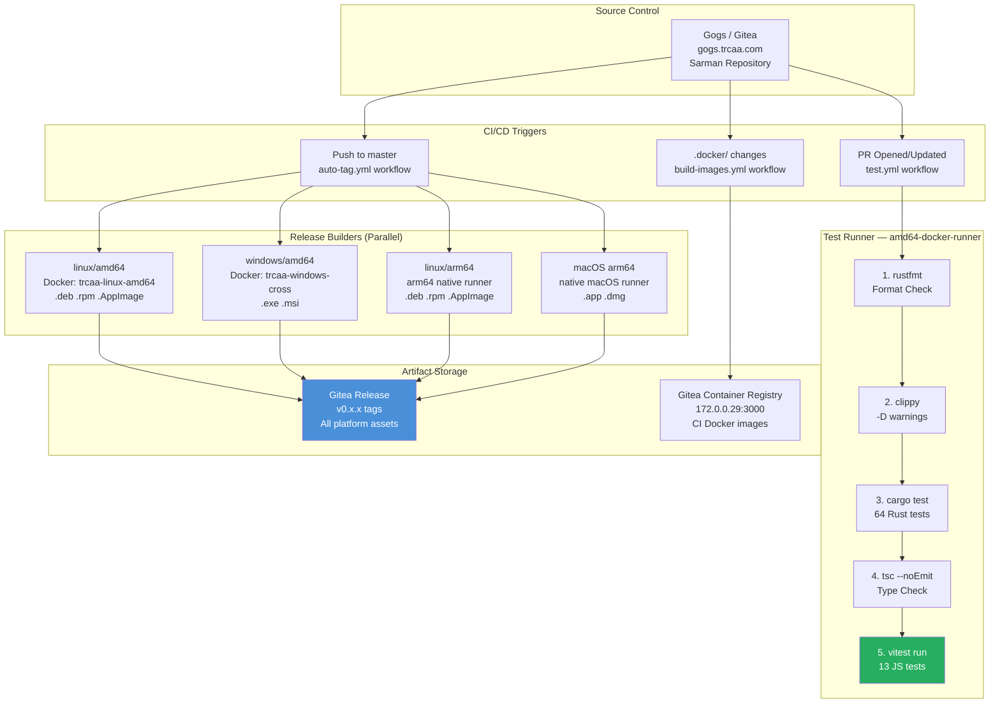

### Runtime Architecture (per Platform)

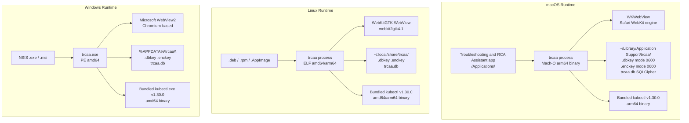

---

## Key Data Flows

### PII Detection and Redaction

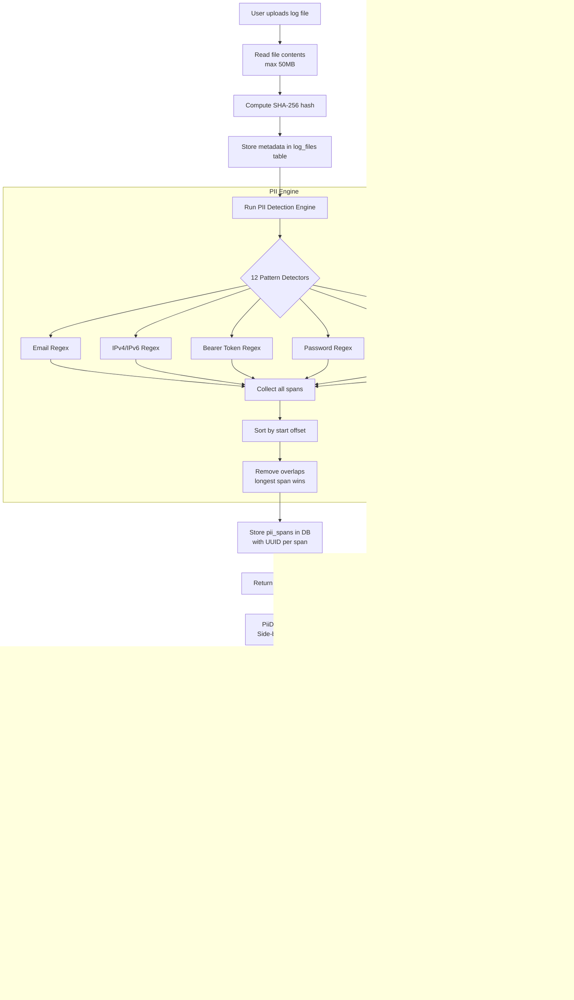

### Encryption Key Lifecycle

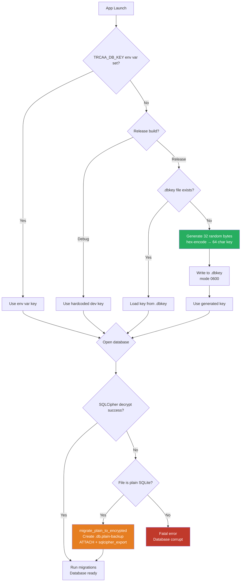

---

## Architecture Decision Records

See the [adrs/](./adrs/) directory for all Architecture Decision Records.

| ADR | Title | Status |
|-----|-------|--------|
| [ADR-001](./adrs/ADR-001-tauri-desktop-framework.md) | Tauri as Desktop Framework | Accepted |
| [ADR-002](./adrs/ADR-002-sqlcipher-encrypted-database.md) | SQLCipher for Encrypted Storage | Accepted |
| [ADR-003](./adrs/ADR-003-provider-trait-pattern.md) | Provider Trait Pattern for AI Backends | Accepted |
| [ADR-004](./adrs/ADR-004-pii-regex-aho-corasick.md) | Regex + Aho-Corasick for PII Detection | Accepted |
| [ADR-005](./adrs/ADR-005-auto-generate-encryption-keys.md) | Auto-generate Encryption Keys at Runtime | Accepted |
| [ADR-006](./adrs/ADR-006-zustand-state-management.md) | Zustand for Frontend State Management | Accepted |
| [ADR-007](./adrs/ADR-007-three-tier-shell-safety.md) | Three-Tier Shell Command Safety Classification | Accepted |
| [ADR-008](./adrs/ADR-008-mcp-protocol-integration.md) | Model Context Protocol for External Tools | Accepted |
| [ADR-009](./adrs/ADR-009-bundled-kubectl-binary.md) | Bundle kubectl Binary for Cross-Platform Consistency | Accepted |
