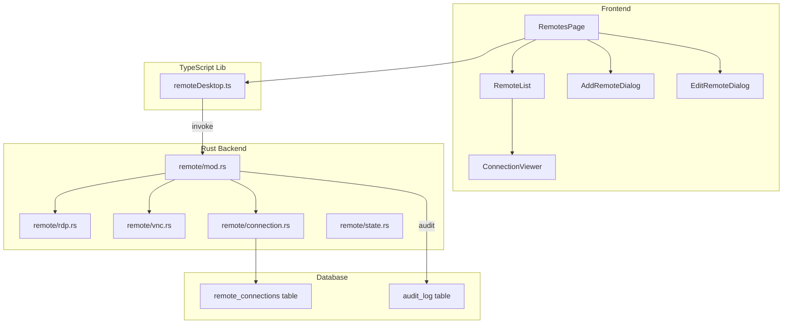
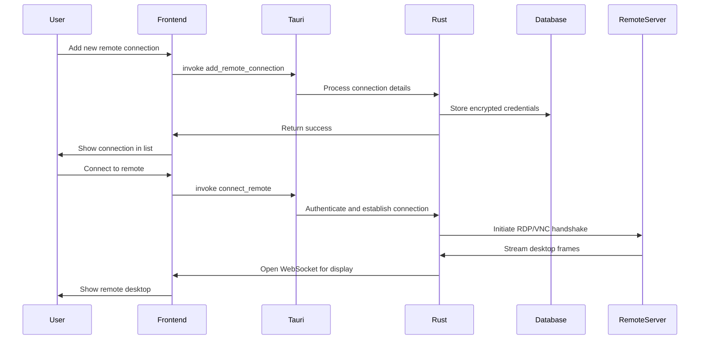

# Remote Desktop Feature Implementation Plan

## Overview

This document outlines the implementation plan for adding Remote Desktop functionality to the Troubleshooting and RCA Assistant application, achieving feature parity with Remmina for RDP and VNC protocols.

## Target Version: 2.0.0

## Feature Scope

### Protocols to Support
1. **RDP (Remote Desktop Protocol)**
   - Microsoft RDP 8.0+ support
   - Resolution adjustment
   - Clipboard sharing
   - Drive redirection (optional)
   - Multi-monitor support
   - Reconnection capability

2. **VNC (Virtual Network Computing)**
   - RFB Protocol 3.8 support
   - Multiple encoding types (Raw, CopyRect, RRE, ZRLE)
   - Clipboard synchronization
   - File transfer (optional)
   - Chat functionality (optional)

## Architecture

### System Design



### Data Flow



## Implementation Steps

### Phase 1: Infrastructure Setup

#### 1.1 Database Schema

Create the `remote_connections` table:

```sql
CREATE TABLE remote_connections (
    id TEXT PRIMARY KEY,
    name TEXT NOT NULL,
    protocol TEXT NOT NULL CHECK(protocol IN ('rdp', 'vnc')),
    hostname TEXT NOT NULL,
    port INTEGER NOT NULL DEFAULT 3389,
    username TEXT,
    password_encrypted TEXT NOT NULL,
    domain TEXT,
    resolution TEXT DEFAULT '1280x800',
    color_depth INTEGER DEFAULT 32,
    clipboard_sync INTEGER DEFAULT 1,
    drive_redirect INTEGER DEFAULT 0,
    multi_monitor INTEGER DEFAULT 0,
    compression INTEGER DEFAULT 1,
    quality INTEGER DEFAULT 80,
    created_at INTEGER NOT NULL,
    updated_at INTEGER NOT NULL,
    last_connected_at INTEGER
);

CREATE INDEX idx_remote_connections_protocol ON remote_connections(protocol);
CREATE INDEX idx_remote_connections_last_connected ON remote_connections(last_connected_at);
```

#### 1.2 Rust Dependencies

Add to `Cargo.toml`:

```toml
# RDP support
freerdp = "3.0"
freerdp-api = "3.0"

# VNC support
libvnc = "0.9"
rfb = "0.2"

# WebSocket for streaming
tokio-tungstenite = "0.21"
ws_stream_tungstenite = "0.11"

# Image processing for frame encoding
image = "0.25"
jpeg-decoder = "0.3"

# Base64 encoding
base64 = "0.22"
```

**License Verification:**
- `freerdp`: Apache-2.0 / MIT (compatible)
- `libvnc`: BSD-3-Clause (compatible)
- `tokio-tungstenite`: MIT (compatible)
- `image`: MIT / Apache-2.0 (compatible)
- All dependencies must be verified for MIT compatibility

### Phase 2: Rust Backend Implementation

#### 2.1 Module Structure

```
src-tauri/src/remote/
├── mod.rs           # Module exports and Tauri command registration
├── rdp.rs           # RDP client implementation
├── vnc.rs           # VNC client implementation
├── connection.rs    # Connection management logic
├── state.rs         # Active connection state management
└── types.rs         # Shared types and enums
```

#### 2.2 Core Types

```rust
// src-tauri/src/remote/types.rs

pub enum Protocol {
    Rdp,
    Vnc,
}

pub struct RemoteConnection {
    pub id: String,
    pub name: String,
    pub protocol: Protocol,
    pub hostname: String,
    pub port: u16,
    pub username: Option<String>,
    pub password_encrypted: String,
    pub domain: Option<String>,
    pub resolution: Resolution,
    pub color_depth: u32,
    pub clipboard_sync: bool,
    pub drive_redirect: bool,
    pub multi_monitor: bool,
    pub compression: bool,
    pub quality: u32,
    pub created_at: i64,
    pub updated_at: i64,
    pub last_connected_at: Option<i64>,
}

pub struct Resolution {
    pub width: u32,
    pub height: u32,
}

pub enum ConnectionState {
    Disconnected,
    Connecting,
    Connected,
    Reconnecting,
    Error(String),
}
```

#### 2.3 RDP Implementation (`rdp.rs`)

Key features:
- Connection establishment using FreeRDP
- Frame capture and encoding
- Input handling (keyboard, mouse)
- Clipboard synchronization
- Credential handling with encryption

```rust
// Pseudocode structure
pub struct RdpClient {
    connection: RemoteConnection,
    session: Option<FreerdpSession>,
}

impl RdpClient {
    pub async fn connect(&mut self) -> Result<WebSocketStream>;
    pub async fn disconnect(&mut self);
    pub fn send_keyboard_event(&self, key: u32, pressed: bool);
    pub fn send_mouse_event(&self, x: i32, y: i32, button: u32);
    pub fn get_clipboard_data(&self) -> Option<String>;
    pub fn set_clipboard_data(&self, data: String);
}
```

#### 2.4 VNC Implementation (`vnc.rs`)

Key features:
- RFB protocol implementation
- Multiple encoding support
- Frame buffer management
- Input event handling

```rust
// Pseudocode structure
pub struct VncClient {
    connection: RemoteConnection,
    session: Option<VncSession>,
}

impl VncClient {
    pub async fn connect(&mut self) -> Result<WebSocketStream>;
    pub async fn disconnect(&mut self);
    pub fn send_keyboard_event(&self, key: u32);
    pub fn send_mouse_event(&self, x: i32, y: i32, mask: u32);
    pub fn request_encoding(&self, encoding: VncEncoding);
}
```

#### 2.5 Connection Management (`connection.rs`)

```rust
pub async fn add_remote_connection(
    id: String,
    name: String,
    protocol: String,
    hostname: String,
    port: u16,
    username: Option<String>,
    password: String,
    // ... other settings
) -> Result<RemoteConnection>;

pub async fn update_remote_connection(
    id: String,
    updates: RemoteConnectionUpdate
) -> Result<RemoteConnection>;

pub async fn remove_remote_connection(id: String) -> Result<()>;

pub async fn list_remote_connections() -> Result<Vec<RemoteConnection>>;

pub async fn connect_remote(id: String) -> Result<String>; // Returns WebSocket URL

pub async fn disconnect_remote(id: String) -> Result<()>;
```

#### 2.6 State Management (`state.rs`)

```rust
pub struct RemoteState {
    active_connections: HashMap<String, Arc<Mutex<ConnectionState>>>,
    connection_handles: HashMap<String, tokio::task::JoinHandle<()>>,
}

impl RemoteState {
    pub fn new() -> Self;
    pub fn add_connection(&mut self, id: String, state: ConnectionState);
    pub fn remove_connection(&mut self, id: &str);
    pub fn get_connection_state(&self, id: &str) -> Option<ConnectionState>;
}
```

### Phase 3: Tauri Command Handlers

Register in `src-tauri/src/lib.rs`:

```rust
invoke_handler(tauri::generate_handler![
    // Remote Desktop commands
    commands::remote::add_remote_connection,
    commands::remote::update_remote_connection,
    commands::remote::remove_remote_connection,
    commands::remote::list_remote_connections,
    commands::remote::get_remote_connection,
    commands::remote::connect_remote,
    commands::remote::disconnect_remote,
    commands::remote::test_remote_connection,
]);
```

### Phase 4: TypeScript Frontend

#### 4.1 Type Definitions

```typescript
// src/types/remote.ts

export type Protocol = 'rdp' | 'vnc';

export interface RemoteConnection {
  id: string;
  name: string;
  protocol: Protocol;
  hostname: string;
  port: number;
  username?: string;
  domain?: string;
  resolution: {
    width: number;
    height: number;
  };
  colorDepth: number;
  clipboardSync: boolean;
  driveRedirect: boolean;
  multiMonitor: boolean;
  compression: boolean;
  quality: number;
  createdAt: number;
  updatedAt: number;
  lastConnectedAt?: number;
  status: 'disconnected' | 'connecting' | 'connected' | 'error';
}

export interface RemoteConnectionForm {
  name: string;
  protocol: Protocol;
  hostname: string;
  port: number;
  username?: string;
  password: string;
  domain?: string;
  resolution: {
    width: number;
    height: number;
  };
  colorDepth: number;
  clipboardSync: boolean;
  driveRedirect: boolean;
  multiMonitor: boolean;
  compression: boolean;
  quality: number;
}
```

#### 4.2 Tauri Commands Wrapper

```typescript
// src/lib/remoteDesktop.ts

import { invoke } from '@tauri-apps/api/core';

export async function addRemoteConnection(
  config: RemoteConnectionForm
): Promise<RemoteConnection> {
  return invoke('add_remote_connection', { config });
}

export async function updateRemoteConnection(
  id: string,
  updates: Partial<RemoteConnectionForm>
): Promise<RemoteConnection> {
  return invoke('update_remote_connection', { id, updates });
}

export async function removeRemoteConnection(id: string): Promise<void> {
  return invoke('remove_remote_connection', { id });
}

export async function listRemoteConnections(): Promise<RemoteConnection[]> {
  return invoke('list_remote_connections');
}

export async function connectRemote(id: string): Promise<string> {
  return invoke('connect_remote', { id });
}

export async function disconnectRemote(id: string): Promise<void> {
  return invoke('disconnect_remote', { id });
}

export async function testRemoteConnection(
  id: string
): Promise<boolean> {
  return invoke('test_remote_connection', { id });
}
```

#### 4.3 UI Components

**RemotesPage** (`src/pages/Remote/RemotesPage.tsx`)
- Main page showing all remote connections
- Add, edit, delete functionality
- Connection status indicators
- Quick connect buttons

**ConnectionViewer** (`src/components/Remote/ConnectionViewer.tsx`)
- Full-screen remote desktop display
- WebSocket connection for real-time frames
- Input event handling
- Toolbar with controls (disconnect, fullscreen, clipboard)

**AddRemoteDialog** (`src/components/Remote/AddRemoteDialog.tsx`)
- Form for adding new connections
- Protocol selection (RDP/VNC)
- Validation for required fields
- Default settings based on protocol

**EditRemoteDialog** (`src/components/Remote/EditRemoteDialog.tsx`)
- Form for editing existing connections
- Pre-populated with current values
- Password field handles re-entry only if changing

### Phase 5: Navigation Integration

Update `src/App.tsx`:

```typescript
const navItems = [
  { to: "/", icon: Home, label: "Dashboard" },
  { to: "/new-issue", icon: Plus, label: "New Issue" },
  { to: "/remote", icon: Monitor, label: "Remote" },  // NEW
  { to: "/kubernetes", icon: Server, label: "Kubernetes" },
  // ... rest of items
];
```

Add route:
```typescript
<Route path="/remote" element={<RemotesPage />} />
```

### Phase 6: Testing

#### 6.1 Rust Unit Tests

```rust
// src-tauri/tests/remote/mod.rs

#[test]
fn test_rdp_connection_struct() {
    // Test RDP connection creation
}

#[test]
fn test_vnc_connection_struct() {
    // Test VNC connection creation
}

#[tokio::test]
async fn test_add_remote_connection() {
    // Test adding a connection to the database
}

#[tokio::test]
async fn test_encryption_decryption() {
    // Test credential encryption/decryption
}
```

#### 6.2 TypeScript Unit Tests

```typescript
// tests/unit/remoteDesktop.test.ts

import { describe, it, expect, vi } from 'vitest';
import * as remoteDesktop from '@/lib/remoteDesktop';

describe('Remote Desktop Commands', () => {
  it('should add a new remote connection', async () => {
    // Test addRemoteConnection
  });

  it('should list all remote connections', async () => {
    // Test listRemoteConnections
  });

  it('should validate connection form', async () => {
    // Test form validation
  });
});
```

#### 6.3 E2E Tests

```typescript
// tests/e2e/specs/remote-desktop.spec.ts

describe('Remote Desktop Feature', () => {
  it('should add a new RDP connection', async () => {
    // Navigate to Remote page
    // Click Add Remote
    // Fill form and submit
    // Verify connection appears in list
  });

  it('should connect to a remote desktop', async () => {
    // Select a connection
    // Click Connect
    // Verify ConnectionViewer opens
  });

  it('should test RDP server at 172.0.1.42', async () => {
    // Add connection to test server
    // Test connection
    // Verify successful connection
  });
});
```

### Phase 7: Version Update

Update version to 2.0.0:

1. `package.json`: `"version": "2.0.0"`
2. `src-tauri/Cargo.toml`: `version = "2.0.0"`
3. `src-tauri/tauri.conf.json`: `"version": "2.0.0"`

### Phase 8: Security & Compliance

1. **Credential Encryption**: Use existing `TRCAA_ENCRYPTION_KEY` or auto-generated `.enckey`
2. **Audit Logging**: Log all connection attempts with timestamps
3. **MIT License Compliance**: Verify all dependencies are MIT/Apache-2.0 compatible
4. **CSP Update**: Add necessary CSP directives for WebSocket connections

## Testing Against RDP Server

Test credentials (DO NOT STORE IN REPO):
- Server: 172.0.1.42
- Username: sarman
- Password: REDACTED

These should be stored only in the application's encrypted database, never in source control.

## Success Criteria

1. ✅ "Remote" menu item appears in navigation
2. ✅ Can add RDP connections with all settings
3. ✅ Can add VNC connections with all settings
4. ✅ Can edit existing connections
5. ✅ Can delete connections
6. ✅ Can connect to RDP servers successfully
7. ✅ Can connect to VNC servers successfully
8. ✅ Clipboard synchronization works
9. ✅ Resolution can be adjusted
10. ✅ All Rust tests pass (100%)
11. ✅ All TypeScript tests pass (100%)
12. ✅ All E2E tests pass (100%)
13. ✅ Version bumped to 2.0.0
14. ✅ MIT license compliant
15. ✅ No credentials in source control

## Risks and Mitigations

| Risk | Impact | Mitigation |
|------|--------|------------|
| FreeRDP integration complexity | High | Start with basic connection, add features incrementally |
| VNC protocol variations | Medium | Support RFB 3.8 as baseline, extend as needed |
| Performance with large resolutions | Medium | Implement frame compression, limit max resolution |
| Cross-platform compatibility | High | Test on Linux, Windows, macOS early |
| Security vulnerabilities | Critical | Code review, dependency audit, penetration testing |

## Timeline

This is a major feature addition. Estimated phases:
- Phase 1-2 (Backend): 2-3 weeks
- Phase 3-4 (Frontend): 1-2 weeks
- Phase 5-6 (Testing): 1-2 weeks
- Phase 7-8 (Release prep): 1 week

Total: 5-8 weeks for full feature parity

---

*This plan should be reviewed and approved before implementation begins.*
